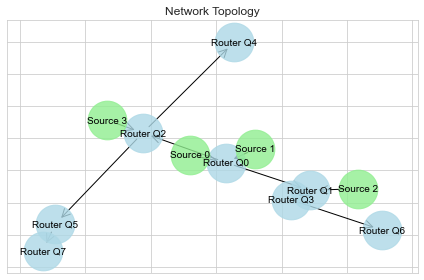

# Network Queueing Simulation



## Introduction to Queueing Theory

**Queueing theory** is the mathematical study of waiting lines, or queues. In many real-world systems—such as network routers handling packets, checkout lines in a supermarket, or support call centers—customers (or packets, tasks, requests) arrive to be processed by servers or resources. Queueing theory helps us understand system performance measures such as average waiting time, queue length, and utilization of servers.

Key components of a queueing system include:
- **Arrival process:** How customers arrive to the system, often modeled as a stochastic process.
- **Service process:** How customers are served, typically with a certain rate or distribution of service times.
- **Queue discipline:** The order in which customers are served (e.g., First-Come-First-Served).

Queueing theory provides analytical frameworks and formulas (such as Little’s Law) to quantify performance metrics, enabling better system design and capacity planning.

## Importance of λ (lambda) and μ (mu)

In many basic queueing models (like M/M/1 queues):
- **λ (lambda)** represents the arrival rate, i.e., how many customers (or packets) arrive per unit time. A higher λ means more frequent arrivals, potentially leading to longer queues and delays if the system is not sufficiently resourced.
- **μ (mu)** represents the service rate, i.e., how many customers can be served per unit time by a single server. A higher μ means the server works faster, reducing congestion and waiting times.

The relationship between λ and μ is critical. If λ ≥ μ, the queue will tend to grow without bound because the server cannot keep up. For stable, finite queues, we generally need λ < μ (i.e., service capacity exceeds arrival demand).

## What Type of Queue is Modeled Here?

Each individual queue in this simulation behaves like an **M/M/1/K** queue:

- **M/M/1/K** indicates:
  - **M**: Poisson (exponential inter-arrival) arrivals, meaning arrival events follow a memoryless (Markovian) process.
  - **M**: Exponential service times, indicating the server's service durations are also memoryless.
  - **1**: A single server per queue.
  - **K**: A finite capacity, meaning the queue can hold only a limited number of packets. If the queue is full, new arrivals are dropped.

**Queue Discipline**: This simulation uses a **First-In-First-Out (FIFO)** or **First-Come-First-Served (FCFS)** queueing discipline at each node.

By combining multiple such queues and sources, you effectively model a network of M/M/1/K queues, capturing more complex topologies and traffic patterns.

## What This Simulation Does

This simulation models a network of routers (queues) and sources (traffic generators) using event-based simulation techniques. Each source generates traffic at a certain arrival rate (λ), and each queue processes packets at a certain service rate (μ). The simulation processes:

- **Arrivals:** Packets arriving at queues from sources or from other queues in the network.
- **Departures:** Packets leaving a queue after being served, potentially causing arrivals in downstream queues.
- **Packet Drops (Optional):** If a queue is full upon arrival, the incoming packet is dropped.

By running the simulation, you can:
- Observe how the network behaves under different loads (varying λ and μ).
- Measure performance metrics like packet drops, average waiting times, and queue lengths.
- Visualize the network topology and event flow.

This simulation serves as a foundation for exploring M/M/1/K queue networks, experimenting with different traffic intensities, and understanding how system parameters impact performance in queueing systems.

## Using the Simulation

### Prerequisites

- **Python 3.11**
- **NumPy:** For exponential random number generation.
- **Matplotlib and Seaborn (Optional):** For data visualization.
- **NetworkX (Optional):** For network topology visualization.

Install dependencies:
```bash
pip install numpy matplotlib seaborn networkx
```

## Example:

Under **/notebooks**, the SimulationAnalysis notebook provides a worked example of the simulation, including:
- A generated topology diagram and 
- Metrics from the simulation run
- The output of the future event list, showing arrivals and departures in the system.

### Example metrics
```bash
------------- Router Q0 -------------
Packets Transmitted: 533
Packets dropped ratio: 0.01097
Packets dropped: 6
Average Transmission time (ms): 0.00028
------------- Router Q1 -------------
Packets Transmitted: 727
Packets dropped ratio: 0.11152
Packets dropped: 92
Average Transmission time (ms): 0.00047
------------- Router Q2 -------------
Packets Transmitted: 636
Packets dropped ratio: 0.07101
Packets dropped: 49
Average Transmission time (ms): 0.00044
------------- Router Q3 -------------
Packets Transmitted: 623
Packets dropped ratio: 0.13480
Packets dropped: 98
Average Transmission time (ms): 0.00058
```

### Example Future Event List

```bash
All Processed Events (including arrivals, departures, and drops):
[Time=0.00000] POLLED: Arrival Event at 0.00000s, Destination Queue: 0, Origin: Source 0
[Time=0.00000] SCHEDULED: Departure Event at 0.00000s, Destination Queue: 0, Origin: Router Q0
[Time=0.00000] SCHEDULED: Arrival Event at 0.00000s, Destination Queue: 0, Origin: Source 0
[Time=0.00003] SCHEDULED: Arrival Event at 0.00003s, Destination Queue: 3, Origin: Router Q1
[Time=0.00003] POLLED: Arrival Event at 0.00003s, Destination Queue: 3, Origin: Router Q1
[Time=0.00003] POLLED: Arrival Event at 0.00003s, Destination Queue: 0, Origin: Source 1
[Time=0.00003] SCHEDULED: Departure Event at 0.00003s, Destination Queue: 0, Origin: Router Q0
[Time=0.00003] SCHEDULED: Arrival Event at 0.00003s, Destination Queue: 0, Origin: Source 1
[Time=0.00003] POLLED: Departure Event at 0.00003s, Destination Queue: 2, Origin: Router Q2
```